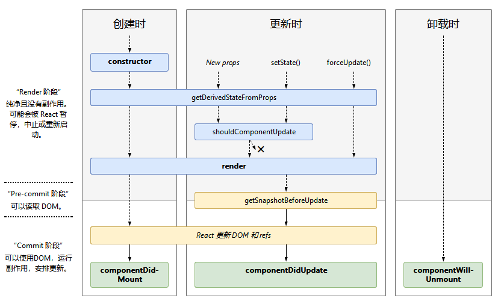

## React.Component

`React.Component`是使用ES6类语法定义组件的基类。

### 生命周期



* 创建
  * constructor()
  * static getDerivedStateFromProps()
  * render()
  * componentDidMount()
* 更新
  * static getDerivedStateFromProps()
  * shouldComponentUpdate()
  * render()
  * getSnapshotBeforeUpdate()
  * componentDidUpdate()
* 卸载
  * componentWillUnmount()
* 错误处理
  * static getDerivedStateFromError()
  * componentDidCatch()

#### render()

```js
render()
```

render是组件内唯一需要实现的方法，其它方法按需实现。

* 返回值
  * React元素：JSX语句
  * 数组或Fragment：返回多个元素
  * Portal：将children渲染到不同的DOM子树
  * 字符串或数字：作为文本节点DOM渲染
  * boolean或null：什么也不渲染
* 必须是纯粹函数：不修改state、每次调用返回相同结果、不直接和浏览器交互，如果必须和浏览器交互，在`componentDidMount()`或其它生命周期处理。

#### constructor()

```js
constructor(props)
```

* 调用时机：组件渲染之前
* 用途
  * 初始化state，constructor是唯一可以对`this.state`直接赋值的地方
  * 绑定方法到实例
* 使用限制
  * 必须在其它任何语句之前调用`super(props)`
  * 禁止调用`setState`方法
  * 避免在构造函数中引入任何副作用或订阅。 对于这些用例，请改用componentDidMount（）。
* 常见错误
  * 避免将props复制到state

```js
constructor(props) {
  super(props);
  // Don't call this.setState() here!
  this.state = { counter: 0 };
  this.handleClick = this.handleClick.bind(this);
}
```

#### componentDidMount()

```js
componentDidMount()
```

* 调用时机：组件渲染之后立即执行
* 用途
  * 初始化DOM节点
  * 请求远程端点数据
  * 订阅，记得在`componentWillUnmount()`中取消订阅
  * 调用`setState()`
    * 结果：触发重渲染，但是发生在浏览器更新屏幕之前，保证即时`render()`触发两次，用户也不会看到中间过程
    * 注意：只在必要时谨慎使用，会引起性能问题

#### componentDidUpdate()

```js
componentDidUpdate(prevProps, prevState, snapshot)
```

* 调用时机：组件更新后立即执行，不会再初次render时调用
* 用途
  * 操作DOM节点
  * 比较当前和上次props，确定是否请求远程端点数据
  * 调用`setState()`
    * 结果：触发重渲染，中间过程用户不可见
    * 注意：必须包含条件，否则导致无限循环；导致性能问题

```js
componentDidUpdate(prevProps) {
  // Typical usage (don't forget to compare props):
  if (this.props.userID !== prevProps.userID) {
    this.fetchData(this.props.userID);
  }
}
```

如果组件实现`getSnapshotBeforeUpdate()`，返回值将作为`componentDidUpdate()`的第三个参数，否则这个参数为undefined。

#### componentWillUnmount()

```js
componentWillUnmount()
```

* 调用时机：组件卸载和销毁之前立即执行
* 用途：执行清理，例如使计时器无效、取消网络请求、清除在`componentDidMount()`创建的订阅
* 注意：不要调用`setState()`

#### shouldComponentUpdate()

```js
shouldComponentUpdate(nextProps, nextState)
```

* 调用时机：接收新的state或props时，组件渲染前执行，在初次渲染或`forceUpdate()`调用时不执行
* 目的：性能优化
* 默认行为：任何state或props变更，触发重渲染
* 用途：指定组件的输出是否被state或props的改变影响
* 注意
  * 不要依赖这个方法阻止渲染，使用前考虑是否可以使用`React.PureComponent`代替
  * 如果确定使用，比较`this.props`和`nextProps`、`this.state`和`nextState`，返回false告诉React跳过更新。但是当state变更时，即使返回false也不会阻止组件重渲染。
  * 不建议使用深度比较或`JSON.stringify()`，效率太低，降低性能
* 对其它生命周期函数影响：返回false，`UNSAFE_componentWillUpdate()`, `render()`, 和 `componentDidUpdate()`不会执行

#### static getDerivedStateFromProps()

```js
static getDerivedStateFromProps(props, state)
```

* 调用时机：render之前调用，无论初次加载还是随后的更新，无论props还是state变更。
* 目的：使组件根据props变更的结果修改内部state
* 返回值：返回对象更新state，或null什么也不更新
* 此方法是静态方法，无法访问组件实例。可以通过在类定义之外提取组件props和state的纯函数，在getDerivedStateFromProps（）和其他类方法之间重用一些代码。
* 使用场景：state依赖props随时间的变化。
* 缺点：导致冗长的代码，并使组件难以维护，考虑替代方案
  * 执行副作用（动画或拉取数据）响应props变更，改用`componentDidUpdate`替代
  * 当props变更时重新计算某些数据，使用[memoization](/React/derived-state.html#memoization)
  * 当props变更时重置state，使用[fully-controlled-component](/React/derived-state.html#建议：fully-controlled-component)或[fully-uncontrolled-component-with-a-key](/React/derived-state.html#建议：fully-uncontrolled-component-with-a-key)

#### getSnapshotBeforeUpdate()

```js
getSnapshotBeforeUpdate(prevProps, prevState)
```

* 调用时机：在最近的渲染输出提交之前
* 用途
  * 捕获变更之前的DOM信息
  * 返回值作为参数传递给`componentDidUpdate()`
* 使用场景：并不常用，可能出现在需要以特殊方式处理滚动位置的聊天线程等UI中。
* 返回值：snapshot值或null

示例:在`getSnapshotBeforeUpdate`中读取scrollHeight是必须的，因为在渲染阶段（render）和提交阶段（getSnapshotBeforeUpdate和componentDidUpdate）值可能存在延时。
```js
class ScrollingList extends React.Component {
  constructor(props) {
    super(props);
    this.listRef = React.createRef();
  }

  getSnapshotBeforeUpdate(prevProps, prevState) {
    // Are we adding new items to the list?
    // Capture the scroll position so we can adjust scroll later.
    if (prevProps.list.length < this.props.list.length) {
      const list = this.listRef.current;
      return list.scrollHeight - list.scrollTop;
    }
    return null;
  }

  componentDidUpdate(prevProps, prevState, snapshot) {
    // If we have a snapshot value, we've just added new items.
    // Adjust scroll so these new items don't push the old ones out of view.
    // (snapshot here is the value returned from getSnapshotBeforeUpdate)
    if (snapshot !== null) {
      const list = this.listRef.current;
      list.scrollTop = list.scrollHeight - snapshot;
    }
  }

  render() {
    return (
      <div ref={this.listRef}>{/* ...contents... */}</div>
    );
  }
}

```

#### 错误边界

仅用于从意外异常中恢复，不要用来控制流程。

只能捕获子组件的错误，不能捕获自身的错误。

### static getDerivedStateFromError()

```js
static getDerivedStateFromError(error)
```

* 调用时机：后代组件抛出错误后
* 参数：抛出的错误
* 返回值：object，用于更新state
* 执行阶段：渲染

```js
class ErrorBoundary extends React.Component {
  constructor(props) {
    super(props);
    this.state = { hasError: false };
  }

  static getDerivedStateFromError(error) {
    // Update state so the next render will show the fallback UI.
    return { hasError: true };
  }

  render() {
    if (this.state.hasError) {
      // You can render any custom fallback UI
      return <h1>Something went wrong.</h1>;
    }

    return this.props.children; 
  }
}
```

### componentDidCatch()

```js
componentDidCatch(error, info)
```

* 调用时机：后代组件抛出错误后
* 参数
  * error：抛出的错误
  * info：带有componentStack键的对象，其中包含有关哪个组件引发错误的信息
* 执行阶段：提交阶段，可以用于执行副作用，例如打印错误日志
* 建议：不要在`componentDidCatch`执行`setState`渲染错误回调UI，使用`static getDerivedStateFromError()`处理错误回调UI。

```js
class ErrorBoundary extends React.Component {
  constructor(props) {
    super(props);
    this.state = { hasError: false };
  }

  static getDerivedStateFromError(error) {
    // Update state so the next render will show the fallback UI.
    return { hasError: true };
  }

  componentDidCatch(error, info) {
    // Example "componentStack":
    //   in ComponentThatThrows (created by App)
    //   in ErrorBoundary (created by App)
    //   in div (created by App)
    //   in App
    logComponentStackToMyService(info.componentStack);
  }

  render() {
    if (this.state.hasError) {
      // You can render any custom fallback UI
      return <h1>Something went wrong.</h1>;
    }

    return this.props.children; 
  }
}
```

#### 遗留生命周期方法

* UNSAFE_componentWillMount()
  * 以前命名：componentWillMount
  * 调用时机：首次加载前，render前执行
  * 替代方案
    * 执行setState：使用constructor代替
    * 执行副作用或订阅：使用componentDidMount()代替
* UNSAFE_componentWillReceiveProps()
  * 以前命名：componentWillReceiveProps
  * 调用时机：props改变时，render前执行，首次加载不执行
  * 替代方案
    * 执行副作用（动画或拉取数据）响应props变更，改用`componentDidUpdate`替代
    * 当props变更时重新计算某些数据，使用[memoization](/React/derived-state.html#memoization)
    * 当props变更时重置state，使用[fully-controlled-component](/React/derived-state.html#建议：fully-controlled-component)或[fully-uncontrolled-component-with-a-key](/React/derived-state.html#建议：fully-uncontrolled-component-with-a-key)
    * 极少数情况下，使用`getDerivedStateFromProps`作为最后的选择
  * 弃用原因：导致bug和数据不一致
* UNSAFE_componentWillUpdate()
  * ```UNSAFE_componentWillUpdate(nextProps, nextState)```
  * 以前命名：componentWillUpdate
  * 调用时机：当接受新的props或state时，render前执行，首次加载不执行
  * 限制：不能调用`this.setState()`，任何触发组件更新的操作都不可以调用
  * 替代方案：使用`componentDidUpdate()`或`getSnapshotBeforeUpdate()`代替


### 其它API

* setState()
* forceUpdate()

#### setState()

```js
setState(updater[, callback])
```

* 执行结果：将变更的组件state排入队列，告诉React这个组件及后代组件需要根据更新的state重绘。
* 用途：响应事件处理或服务端响应以更新界面
* 特点
  * 异步执行，组件不会立即被更新
  * 批量延迟执行，多个setState可能会在一个批次执行
* 陷阱：在setState后通过this.state立即读取state的值不会得到想要的结果
  * 解决办法：使用`componentDidUpdate`或setState回调
* 执行结果：除非`shouldComponentUpdate()`返回false，总是导致界面重绘
* 参数
  * 第一个参数updater
    * 函数：格式```(state, props) => stateChange```
    * 对象：浅层合并到新的state
  * 第二个参数callback可选：函数，在组件重绘后执行，建议使用`componentDidUpdate()`替代


state是组件变更后state对象的引用，不可以直接赋值更改。

```js
this.setState((state, props) => {
  return {counter: state.counter + props.step};
});
```

#### forceUpdate()

```js
component.forceUpdate(callback)
```

默认情况下，props或state变更时，组件会自动重绘。如果`render()`依赖其它数据，可以调用`forceUpdate()`告诉React组件需要重绘。

调用`forceUpdate()`会跳过`shouldComponentUpdate()`，子组件的生命周期函数不会被影响。

正常来说避免使用`forceUpdate()`。

### 类属性

* defaultProps
* displayName

#### defaultProps

组件类属性，设置组件默认props，用于值为`undefined`的props，不用于值为`null`的props。

#### displayName

用于调试信息，不需要显式设置因为默认从函数名或类名推断。

如果需要显示不同的名称用来调试或创建HOC，可以显式设置。


### 实例属性

* props
* state

#### props

包含组件定义的props。

`this.props.children`是一个特殊props，由JSX表达式的子标签定义。

#### state

包含随时间变化的组件特定数据，由用户定义，必须是普通的javascript对象。

如果某些值未用于render或数据流（例如，计时器ID），则不必将其放到state。 可以将此类值定义为组件实例上的字段。

永远不要直接改变this.state，把this.state看作是不可变的。
