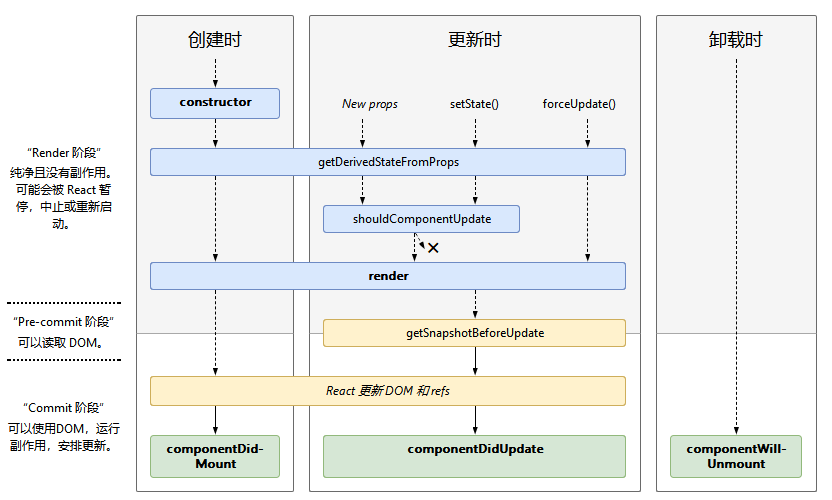

## React.Component

`React.Component`是使用ES6类语法定义组件的基类。

### 生命周期



* 创建
  * constructor()
  * static getDerivedStateFromProps()
  * render()
  * componentDidMount()
* 更新
  * static getDerivedStateFromProps()
  * shouldComponentUpdate()
  * render()
  * getSnapshotBeforeUpdate()
  * componentDidUpdate()
* 卸载
  * componentWillUnmount()
* 错误处理
  * static getDerivedStateFromError()
  * componentDidCatch()

#### render()

```js
render()
```

render是组件内唯一需要实现的方法，其它方法按需实现。

* 返回值
  * React元素：JSX语句
  * 数组或Fragment：返回多个元素
  * Portal：将children渲染到不同的DOM子树
  * 字符串或数字：作为文本节点DOM渲染
  * boolean或null：什么也不渲染
* 必须是纯粹函数：不修改state、每次调用返回相同结果、不直接和浏览器交互，如果必须和浏览器交互，在`componentDidMount()`或其它生命周期处理。

#### constructor()

```js
constructor(props)
```

* 调用时机：组件渲染之前
* 用途
  * 初始化state，constructor是唯一可以对`this.state`直接赋值的地方
  * 绑定方法到实例
* 使用限制
  * 必须在其它任何语句之前调用`super(props)`
  * 禁止调用`setState`方法
  * 避免在构造函数中引入任何副作用或订阅。 对于这些用例，请改用componentDidMount（）。
* 常见错误
  * 避免将props复制到state

```js
constructor(props) {
  super(props);
  // Don't call this.setState() here!
  this.state = { counter: 0 };
  this.handleClick = this.handleClick.bind(this);
}
```

#### componentDidMount()

```js
componentDidMount()
```

* 调用时机：组件渲染之后立即执行
* 用途
  * 初始化DOM节点
  * 请求远程端点数据
  * 订阅，记得在`componentWillUnmount()`中取消订阅
  * 调用`setState()`
    * 结果：触发重渲染，但是发生在浏览器更新屏幕之前，保证即时`render()`触发两次，用户也不会看到中间过程
    * 注意：只在必要时谨慎使用，会引起性能问题

#### componentDidUpdate()

```js
componentDidUpdate(prevProps, prevState, snapshot)
```

* 调用时机：组件更新后立即执行，不会再初次render时调用
* 用途
  * 操作DOM节点
  * 比较当前和上次props，确定是否请求远程端点数据
  * 调用`setState()`
    * 结果：触发重渲染，中间过程用户不可见
    * 注意：必须包含条件，否则导致无限循环；导致性能问题

```js
componentDidUpdate(prevProps) {
  // Typical usage (don't forget to compare props):
  if (this.props.userID !== prevProps.userID) {
    this.fetchData(this.props.userID);
  }
}
```

如果组件实现`getSnapshotBeforeUpdate()`，返回值将作为`componentDidUpdate()`的第三个参数，否则这个参数为undefined。

#### componentWillUnmount()

```js
componentWillUnmount()
```

* 调用时机：组件卸载和销毁之前立即执行
* 用途：执行清理，例如使计时器无效、取消网络请求、清除在`componentDidMount()`创建的订阅
* 注意：不要调用`setState()`

#### shouldComponentUpdate()

```js
shouldComponentUpdate(nextProps, nextState)
```

* 调用时机：接收新的state或props时，组件渲染前执行，在初次渲染或`forceUpdate()`调用时不执行
* 目的：性能优化
* 默认行为：任何state或props变更，触发重渲染
* 用途：指定组件的输出是否被state或props的改变影响
* 注意
  * 不要依赖这个方法阻止渲染，使用前考虑是否可以使用`React.PureComponent`代替
  * 如果确定使用，比较`this.props`和`nextProps`、`this.state`和`nextState`，返回false告诉React跳过更新。但是当state变更时，即使返回false也不会阻止组件重渲染。
  * 不建议使用深度比较或`JSON.stringify()`，效率太低，降低性能
* 对其它生命周期函数影响：返回false，`UNSAFE_componentWillUpdate()`, `render()`, 和 `componentDidUpdate()`不会执行

#### static getDerivedStateFromProps()

```js
static getDerivedStateFromProps(props, state)
```

* 调用时机：render之前调用，无论初次加载还是随后的更新，无论props还是state变更。
* 返回值：返回对象更新state，或null什么也不更新
* 使用场景：state依赖props随时间的变化。
* 缺点：导致冗长的代码，并使组件难以维护，考虑替代方案
  * 执行副作用（动画或拉取数据）响应props变更，改用`componentDidUpdate`替代
  * 当props变更时重新计算某些数据，使用memoization helper
  * 当props变更时重置state，使用fully-controlled-component或fully-uncontrolled-component-with-a-key
* 此方法是静态方法，无法访问组件实例。可以通过在类定义之外提取组件props和state的纯函数，在getDerivedStateFromProps（）和其他类方法之间重用一些代码。

### 其它API

* setState()
* forceUpdate()

### 类属性

* defaultProps
* displayName

### 实例属性

* props
* state
